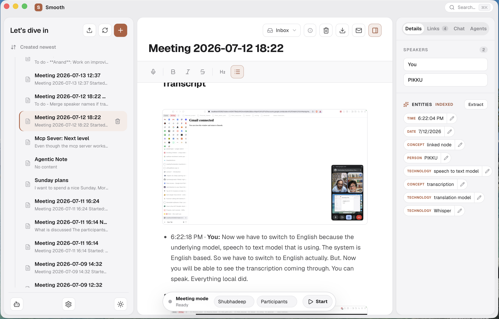

# Smooth

Smooth is a desktop knowledge-bank app (built with Tauri + React) for capturing, writing, and connecting notes. It combines:



- **Notes & folders** — a local, file-backed note store (Markdown on disk, metadata in SQLite) with linking between related notes.
- **Document import** — bring in existing Office, PDF, and text/Markdown files; they're converted to Markdown and dropped into an `Imported` folder.
- **Meeting capture** — record microphone and/or system audio during a meeting, transcribe it locally with `whisper.cpp`, and optionally diarize speakers.
- **Semantic search & entity linking** — background extraction jobs surface related notes and suggested links based on shared entities.
- **Chat** — talk to your notes through Smooth's managed local `llama.cpp` server, with an external-server fallback.
- **Gmail & Calendar integration** — draft follow-up emails and read upcoming events from within the app.
- **MCP server** — expose read-only note access (`read_note`, `search_notes`, `get_link_suggestions`) to MCP clients like Claude Desktop over a local, bearer-token-authenticated HTTP endpoint.

## Prerequisites

- Node.js (see `.nvmrc`/your version manager of choice) and npm
- Rust (stable toolchain) and the [Tauri CLI](https://v2.tauri.app/) prerequisites for your platform
- A `whisper.cpp` GGML model if you want speech-to-text (path is configured in-app)
- `llama-server` in `PATH` (or `LLAMA_SERVER_PATH` set to its executable) when building the managed local-model feature

## Development

```bash
npm install
npm run tauri:dev        # default build (Metal acceleration on macOS)
npm run tauri:dev:metal  # explicit Metal build
```

Other acceleration backends are available as Cargo features on the `src-tauri` crate: `coreml`, `cuda`, `hipblas`, `openblas`, `openmp`, `vulkan`.

## Building

```bash
npm run tauri:build       # Metal (default on macOS)
npm run tauri:build:cpu   # CPU-only, no acceleration feature
```

These commands run `cargo clean` for the main Tauri crate and the diarization
sidecar before building. This prevents old feature combinations and incremental
artifacts from accumulating in their `target` directories. Development commands
do not clean automatically, so restarting `tauri dev` remains fast.

Additional Tauri build options can be forwarded after `--`:

```bash
npm run tauri:build -- --debug --bundles app
```

The build stages `llama-server` as a Tauri sidecar. On macOS it also copies,
rewrites, and signs the sidecar's non-system dynamic libraries so the app does
not depend on Homebrew at runtime. Set `LLAMA_SERVER_PATH` when the executable
is not in the build environment's `PATH`.

Smooth starts the managed server on first LLM use. Models download into the
app-data `models/llama` directory via `LLAMA_CACHE`; they are not written to the
user's global Hugging Face cache. Managed server settings and an external
localhost-server fallback are available in Settings.

## Document import

Import existing documents into your notes via the upload icon next to the notes refresh button:

- Supported inputs: Office documents, structured data, plain text, Markdown, and other source files (converted via `anytomd`), plus text-based PDFs (via `unpdf`).
- Imports run through a durable, single-worker queue with retry and crash recovery, so a restart mid-import won't lose or corrupt a job.
- Each job is deduplicated by SHA-256; re-importing the same file reports **Already imported** and offers **Import copy**.
- Embedded images are copied into app data with Markdown links rewritten to match; imported notes automatically flow into the existing entity extraction and semantic search indexing.
- Imported notes land in an immutable `Imported` system folder (cannot be renamed).
- Image-only scanned PDFs fail explicitly with an OCR-required message instead of silently producing an empty note.

## MCP server

Smooth runs a local, read-only MCP server on `http://127.0.0.1:17843/mcp`, secured with a bearer token. The token is auto-generated on first run and can be viewed, edited, or regenerated from the app's MCP settings panel.

## Example Claude Desktop MCP configuration

Claude Desktop only talks to MCP servers over stdio, but Smooth's MCP server speaks HTTP. [`mcp-remote`](https://www.npmjs.com/package/mcp-remote) bridges the two, and `mcp-remote-wrapper.sh` (in this repo's root) makes sure that bridge can actually find Node — Claude Desktop launches configured commands without your shell's `PATH`, so a bare `npx` call frequently fails to resolve.

1. Copy `mcp-remote-wrapper.sh` from this repo to a permanent location, e.g. `~/mcp-remote-wrapper.sh`, and make it executable: `chmod +x ~/mcp-remote-wrapper.sh`.
2. Run `which npx` in a terminal and copy the directory it's in (drop the trailing `/npx`). This is your `NODE_DIR`.
3. Get your bearer token from the app's MCP settings panel (see [MCP server](#mcp-server) above).
4. Add an entry to Claude Desktop's MCP configuration, pointing at your copy of the script. You don't edit the script itself — it reads `NODE_DIR` and the auth header from the `env` block below:

```json
"mcpServers": {
    "smooth-bridge": {
      "command": "/Users/you/mcp-remote-wrapper.sh",
      "args": [
        "-y",
        "mcp-remote",
        "http://127.0.0.1:17843/mcp",
        "--header",
        "Authorization:${AUTH_HEADER}",
        "--transport",
        "http-only"
      ],
      "env": {
        "NODE_DIR": "/Users/you/.nvm/versions/node/v24.7.0/bin",
        "AUTH_HEADER": "Bearer <YOUR TOKEN>"
      }
    }
  }
```

- Do **NOT** commit your token to version control.
- If you regenerate the token in Smooth's MCP settings panel, update `AUTH_HEADER` here too — the old token stops working immediately.
